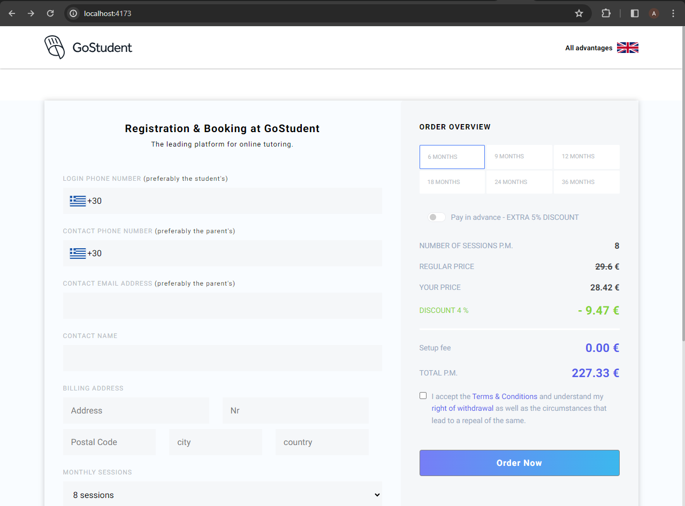

# GoStudent's order page

This task involves recreating a UI similar to GoStudent's order page, utilizing advanced front-end techniques.

## Table of Contents

- [Overview](#overview)
  - [Built with](#built-with)
  - [Screenshot](#screenshot)
  - [Links](#links)
  - [Features](#Features)
- [Author](#author)

## Overview

### Built with

- Semantic HTML5
- CSS Modules
- ReactJs
- RESTful API
- Context API
- vite 

### Screenshot

### Links

- Live Site URL: [Order page]()

### Features

- Fully responsive design for all devices.
- Implement fetching and handling of data from REST APIs.
- Implement form validation for enhanced user experience.
- Dynamically change country flags based on user selection.
- Update countries   calling codes dynamically according to user selection.
- Order Overview calculation, considering discounts and calculating the total.
- Achieve a perfect SEO aspect score of 100%.
- Enhance the overall Lighthouse report to improve performance.

## Author

- <a href="https://www.linkedin.com/in/abdelrahmmaan/" target="_blank">LinkedIn</a>

